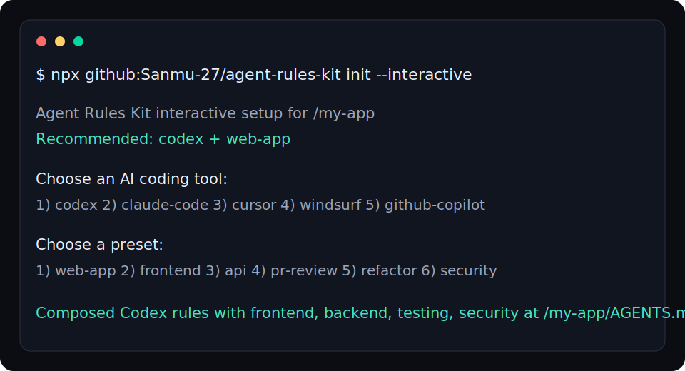

# Agent Rules Kit

[](https://www.npmjs.com/package/ai-agent-rules-kit)
[](https://github.com/Sanmu-27/agent-rules-kit/actions/workflows/test.yml)
[](LICENSE)
[](package.json)

Make AI coding agents follow your engineering standards.

Agent Rules Kit is a zero-dependency CLI and rule library for Codex, Claude Code, Cursor, Windsurf, and GitHub Copilot.

Instead of telling every agent the same rules by hand, install a project-specific instruction file in seconds.

```bash
npx github:Sanmu-27/agent-rules-kit init --interactive
npx github:Sanmu-27/agent-rules-kit init cursor --preset web-app
npx github:Sanmu-27/agent-rules-kit doctor
```

```text
Recommended setup: ai-agent-rules-kit init codex --preset web-app
```

## 30-Second Demo



## Before And After

| Without Rules | With Agent Rules Kit |
| --- | --- |
| Agent edits before reading the codebase | Agent is told to inspect relevant files first |
| Agent rewrites unrelated files | Agent is told to keep changes scoped |
| Agent skips tests | Agent is told to run focused verification |
| Agent ignores local style | Agent is told to follow existing patterns |
| PR review is vague | Review rules prioritize bugs, regressions, security, and missing tests |

## Demo Output

```bash
$ npx github:Sanmu-27/agent-rules-kit init --interactive

Agent Rules Kit interactive setup for /my-app
Recommended: codex + web-app

Choose an AI coding tool:
1) codex  2) claude-code  3) cursor  4) windsurf  5) github-copilot

Choose a preset:
1) web-app  2) frontend  3) api  4) pr-review  5) refactor  6) security

Composed Codex rules with frontend, backend, testing, security at /my-app/AGENTS.md
```

Planned npm command after publishing:

```bash
npx ai-agent-rules-kit init --interactive
```

## Why Developers Star This

AI coding agents are useful, but they often fail in predictable ways:

- they edit before reading the code
- they rewrite unrelated files
- they skip tests
- they ignore existing patterns
- they produce vague code reviews
- they miss security-sensitive edge cases

Agent Rules Kit gives you practical instruction files that reduce those failures, plus a CLI to install them in seconds.

## What You Get

| Category | Included |
| --- | --- |
| Agent files | Codex, Claude Code, Cursor, Windsurf, GitHub Copilot |
| Rule packs | Frontend, backend, testing, code review, security, refactor |
| Presets | Web app, frontend, API, PR review, refactor, security |
| Prompts | Bug fix, feature implementation, PR review |
| CLI | `doctor`, `init`, `init --interactive`, `list`, `install`, `compose`, `show` |
| GitHub-ready repo | Issue template, PR template, CI workflow |

## Quick Start

Generate a ready-to-use rule file:

```bash
npx github:Sanmu-27/agent-rules-kit init codex --preset web-app
```

Or let the CLI recommend a setup:

```bash
npx github:Sanmu-27/agent-rules-kit init --interactive
```

This creates:

```text
AGENTS.md
```

Check an existing repo:

```bash
npx github:Sanmu-27/agent-rules-kit doctor
```

`doctor` also recommends the best starting command for the current project.

Compose a richer rule file:

```bash
npx github:Sanmu-27/agent-rules-kit compose cursor --packs frontend,testing,security
```

This creates:

```text
.cursorrules
```

Preview a rule pack:

```bash
npx github:Sanmu-27/agent-rules-kit show code-review
```

Install into another project:

```bash
npx github:Sanmu-27/agent-rules-kit install claude-code --dir ../my-app
```

Overwrite an existing file:

```bash
npx github:Sanmu-27/agent-rules-kit install codex --force
```

## Recipes

Next.js, Remix, or full-stack web app:

```bash
npx github:Sanmu-27/agent-rules-kit init cursor --preset web-app
```

Node, Python, Go, or Rust API:

```bash
npx github:Sanmu-27/agent-rules-kit init codex --preset api
```

PR review assistant:

```bash
npx github:Sanmu-27/agent-rules-kit init claude-code --preset pr-review
```

Security-sensitive repository:

```bash
npx github:Sanmu-27/agent-rules-kit init github-copilot --preset security
```

## Supported Tools

| Tool | Command | Output |
| --- | --- | --- |
| Codex | `ai-agent-rules-kit install codex` | `AGENTS.md` |
| Claude Code | `ai-agent-rules-kit install claude-code` | `CLAUDE.md` |
| Cursor | `ai-agent-rules-kit install cursor` | `.cursorrules` |
| Windsurf | `ai-agent-rules-kit install windsurf` | `.windsurfrules` |
| GitHub Copilot | `ai-agent-rules-kit install github-copilot` | `.github/copilot-instructions.md` |

## Presets

| Preset | Packs |
| --- | --- |
| `web-app` | `frontend`, `backend`, `testing`, `security` |
| `frontend` | `frontend`, `testing` |
| `api` | `backend`, `testing`, `security` |
| `pr-review` | `code-review`, `testing`, `security` |
| `refactor` | `refactor`, `testing` |
| `security` | `security`, `code-review`, `testing` |

## Rule Packs

| Pack | Use When |
| --- | --- |
| `frontend` | Building UI, product flows, responsive layouts, accessibility |
| `backend` | Changing APIs, services, jobs, data access, validation |
| `testing` | Adding or updating tests for behavior changes |
| `code-review` | Reviewing diffs and pull requests |
| `security` | Touching auth, permissions, secrets, uploads, webhooks, data access |
| `refactor` | Cleaning code without changing behavior |

## Example Rule Stack

For a production web app:

```bash
npx ai-agent-rules-kit compose codex --packs frontend,backend,testing,security
```

For PR review:

```bash
npx ai-agent-rules-kit compose claude-code --packs code-review,testing,security
```

For a focused frontend repo:

```bash
npx ai-agent-rules-kit compose cursor --packs frontend,testing
```

## Example Output

The generated rule files tell agents to:

- inspect the existing implementation before editing
- prefer local patterns over new abstractions
- keep changes scoped to the user request
- avoid reverting user changes
- run the smallest meaningful verification command
- lead code reviews with bugs, risks, and missing tests
- treat auth, secrets, uploads, and webhooks as security-sensitive

## Repository Layout

```text
agent-rules-kit/
  bin/                  # CLI
  codex/                # AGENTS.md template
  claude-code/          # CLAUDE.md template
  cursor/               # .cursorrules template
  windsurf/             # Windsurf rules
  github-copilot/       # Copilot instructions
  frontend/             # Frontend pack
  backend/              # Backend pack
  testing/              # Testing pack
  code-review/          # Review pack
  security/             # Security pack
  refactor/             # Refactor pack
  prompts/              # Copy-ready prompts
  test/                 # CLI tests
```

## Local Development

```bash
npm test
node ./bin/agent-rules-kit.js list
node ./bin/agent-rules-kit.js compose codex --packs frontend,testing --dir ./tmp
```

## Copy-Ready Prompt

Use this when asking an agent to work on an unfamiliar codebase:

```text
Before editing, inspect the relevant files and identify the existing patterns.
Make the smallest change that solves the request.
Do not rewrite unrelated code.
After editing, run the most relevant test or verification command available.
In the final response, summarize what changed, what was verified, and any remaining risk.
```

## Contributing

Contributions are welcome. Good additions are:

- short enough to be followed
- specific enough to change agent behavior
- tested in real projects
- focused on reliability, maintainability, or developer workflow

See [`CONTRIBUTING.md`](CONTRIBUTING.md).

## License

MIT
